# Wireless Septic Controller
I had some problems with my newly installed aerobic septic system when hurricane Harvey blew through. There was no significant flooding but there was plenty of rain and that seemed to cause the system to pump multiple times. This board is designed to give visibility as to how often the pump runs and will detail alarm conditions. The effluent pump is controlled with an external 50A Solid-State-Relay (SSR). This board also provides an alarm output required by most aerobic septic systems. Normally the alarm switches are wired in parallel so that any alarm condition with turn on the light and audible alert. This board has separate inputs for three alarm switches so that the alarm condition can be identified. This board supports the following alarm types: air pressure failure alarm, tank high level alarm, and bleach low level alarm. WiFi is provided by an ATWINC1500 module which is an excellent low power WiFi module that is directly supported by Arduino. This board is fully compatible with the Arduino MRK1000 which includes a SAMD21G18 ARM processor and a ATWINC1500 module. This board uses MQTT to communicate with Home Assistant home automation software. The MQTT client/server model is very effective in this situation.

This PCB is designed using [KiCad](http://kicad-pcb.org). Note this design is using a nightly build of KiCad NOT the current released version (4.07).

_Note: The LMZ21700 Simple Switcher, SAMD21G18, and ATWINC1500 have exposed pads on the bottom which requires either a reflow oven or hot air to solder properly._

## Status
Not tested yet.

* Rev 1.0 PCB has been ordered from [OSH Park](https://oshpark.com/shared_projects/bguWSc9J).

## Board Preview
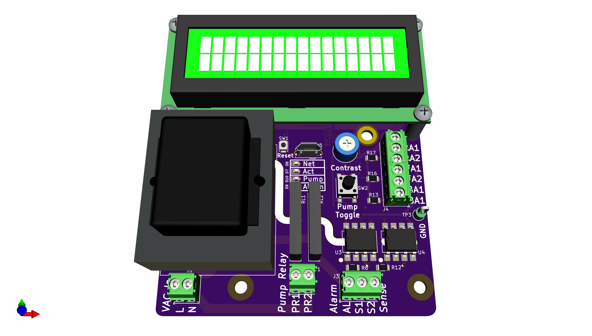

## Design
### Input Power
A transformer convert the 115VAC to 10VAC through a standard bridge rectifier and capacitor filter to arrive at approximately 12VDC. This voltage is fed to both a 3.3VDC and 5VDC Simpler Switcher from Texas Instruments ([LMZ21700](datasheets/Texas Instruments LMZ21700 Simple Switcher.pdf)). The switchers can also be fed by the 5VDC from the USB connector when the 115VAC is not connected. But make note, the 5VDC is no longer regulated.

### Alarm Contact Inputs
There are three alarm contact inputs: air pressure failure alarm, tank high level alarm, and bleach low level alarm. Aerobic septic systems have an air compressor that pumps air into the septic tank, hence the name "aerobic". This air pump promotes bacterial growth and it runs all the time. If the air pump stops producing air pressure the air pressure failure alarm contact closes. Many aerobic septic systems use liquid bleach for the chlorine source and some regulatory boards require low bleach level alarm. My aerobic septic system has three float switches but only one is the tank high level alarm. This float switch is at the highest point in the tank and this alarm means the pump cannot keep up with the water entering the tank. This is usually caused by the effluent pump failing.

In the previous wiring of the septic controller the alarm contacts were wired in parallel logically "or'ing" the alarms. The contacts switched 115VAC to the alarm light and audible alert. In order to determine the actual alarm state the wiring was changed to directly connect these contacts to the the board and they no longer switch 115VAC. The alarm contact inputs use a simple pullup to 5VDC and a Schmidt Trigger Inverter ([LMZ21700](datasheets/Texas Instruments SN74LVC2G14 Dual Schmitt-Trigger Inverter.pdf)). Note: software debounce is still required. A high value pullup resistor and series resistor (both 100k) were selected to reduce current levels when accidental high voltages are applied to the input. ESD Protection devices are included to further protect the inputs. Due the inverted the software sees a logic high when the contact is closed.

### Sense Inputs
There are two 115VAC sense inputs (S1 and S2). These inputs are connected to a [MID400](datasheets/On Semi MID400 AC Line Monitor.pdf) Line Monitor. This optically-isolated device provides a logic low when 115VAC is present on the input. There is no flickering due to 60Hz AC. S1 is used to sense when the effluent pump has power. These is needed because the effluent pump can be turned on when the override float is tripped. S2 is currently unused.

### Relay Outputs
There are two relay outputs on the PR and ALM. Both are switched 115VAC by small board mount solid state relays ([SSR](datasheets/IXYS CPC1511 SSR with Overload Protection.pdf)). These SSRs provide overload protection for both temperature and current. The Pump Relay (PR) output is connected to the effluent pump 50A solid state relay ([SSR](datasheets/Crydom CWA2450-10 Solid State Relay.pdf)). A 50A relay is needed to drive the 3/4hp effluent pump. Note this relay is controlled by 115VAC. The other relay output (AL) is the alarm output. The alarm light and audible alert require 10W at 115VAC. The alarm output is switched on when any alarm contact is closed. There is no software intervention required to produce an alarm.

### SAMD ARM Processor and WiFi Module
The ARM processor and ATWINC1500 WiFi module are wired identical to the MKR1000 Arduino board, thus the Arduino development environment is used for software development and the ATWINC1500 module is directly supported. Digital power is 3.3V and while the LCD is 5V there are no 5V outputs driving 3.3V inputs on the ARM processor so there is no problem wiring the LCD directly to the ARM processor. The LCD recognizes anything above 2.2VDC as a high so 3.3VDC logic outputs from ARM processor will be correctly interpreted by the LCD.

## Setup
### Arduino Setup
This board is designed to mimic a [MKR1000](https://store.arduino.cc/usa/arduino-mkr1000) board from Arduino. Make sure the the MKR1000 board is supported by installing . Do this by opening the Board Manager as shown below.

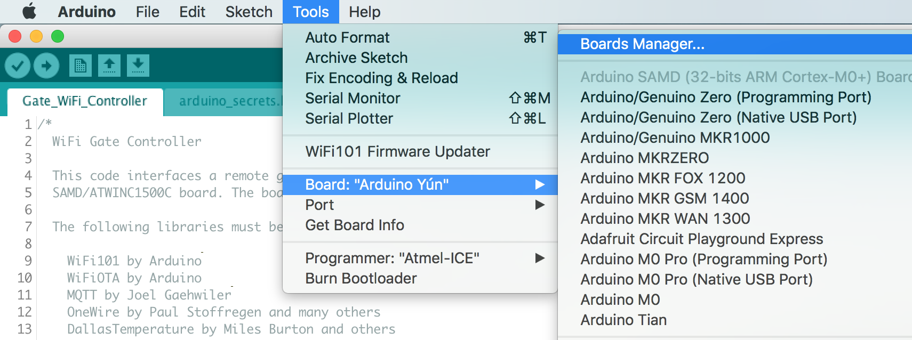

Type in "samd" in the filter edit and you will see several options. Select "Arduino SAMD Boards (32-bits ARM Cortex-M0+)" and install the latest version as shown below.

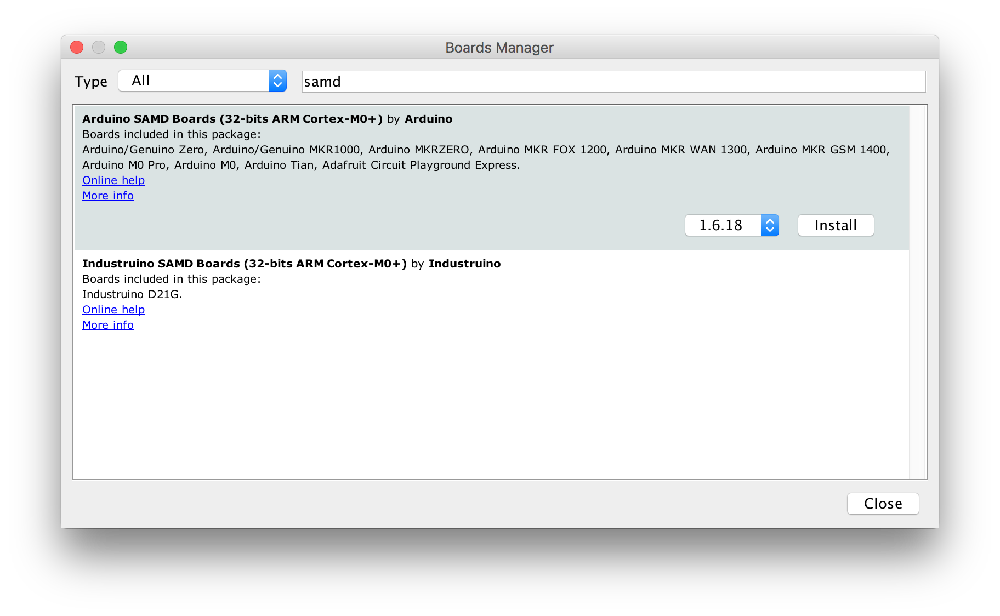

It will take a few minutes to download and install the board package. Once complete it's time to install the necessary libraries. Start by opening the Library Manager as shown below.

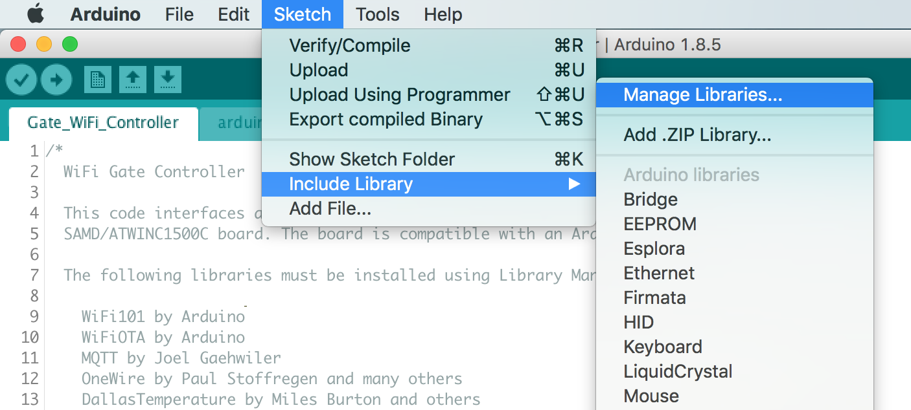

Type in "mqtt" in the filter edit and scroll down until you see "MQTT by Joel Gaehwiler" as shown below.

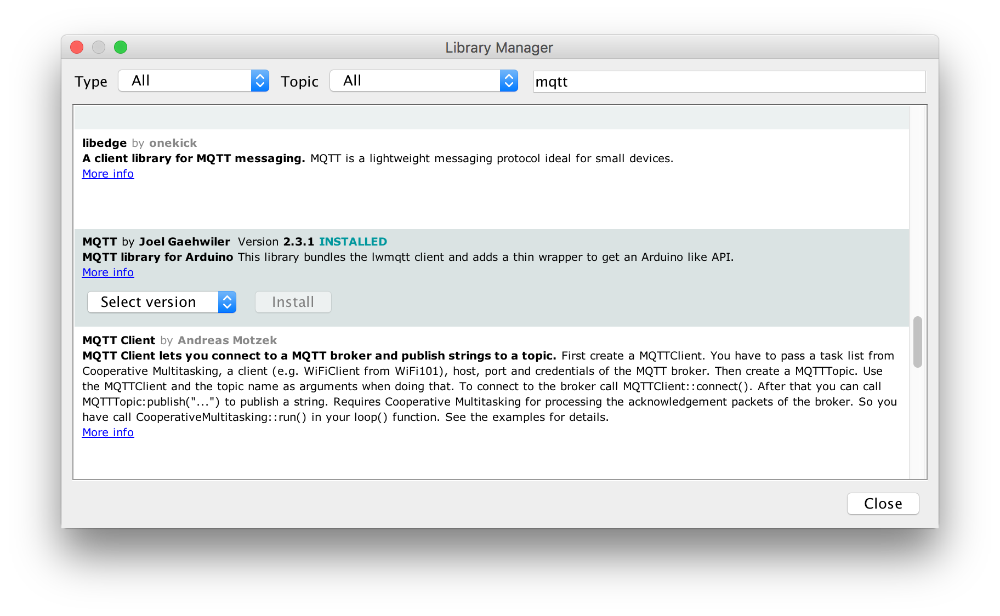

Once "MQTT" is installed repeat the install for the following libraries.

* WiFi101 by Arduino
* WiFiOTA by Arduino
* OneWire by Paul Stoffregen and many others
* DallasTemperature by Miles Burton and others

### Board Setup
The Arduino development environment expects a bootloader in the SAMD ARM processor which will allow programming via USB. The bootloader must be programmed first using a supported programming pod. I used an "Atmel-ICE" pod but there are other options. First make sure you have selected the "Arduino/Genuino MKR1000" board as shown below.

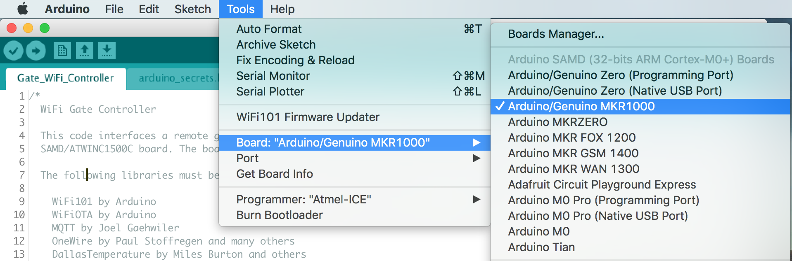

Next select your programmer.

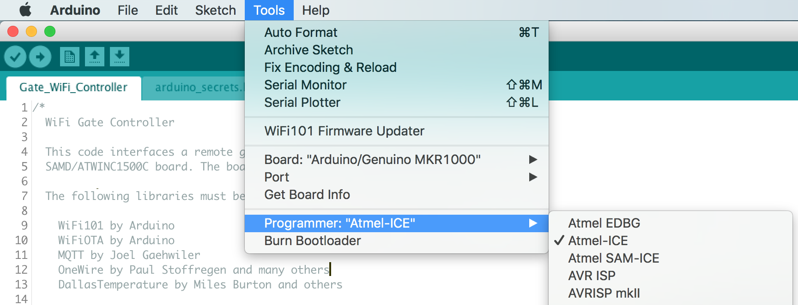

Make sure the board is powered via USB and the programmer is connected to the debug connector then select "Burn Bootloader".

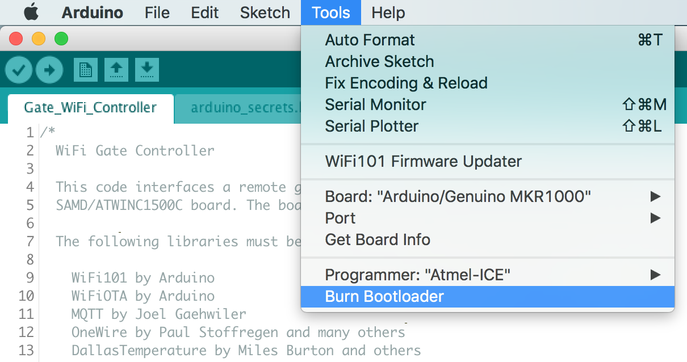

Now the bootloader is programmed it's time to load the "WiFi101 FirmwareUpdater" example. This will update the firmware in the ATWINC1500 module.

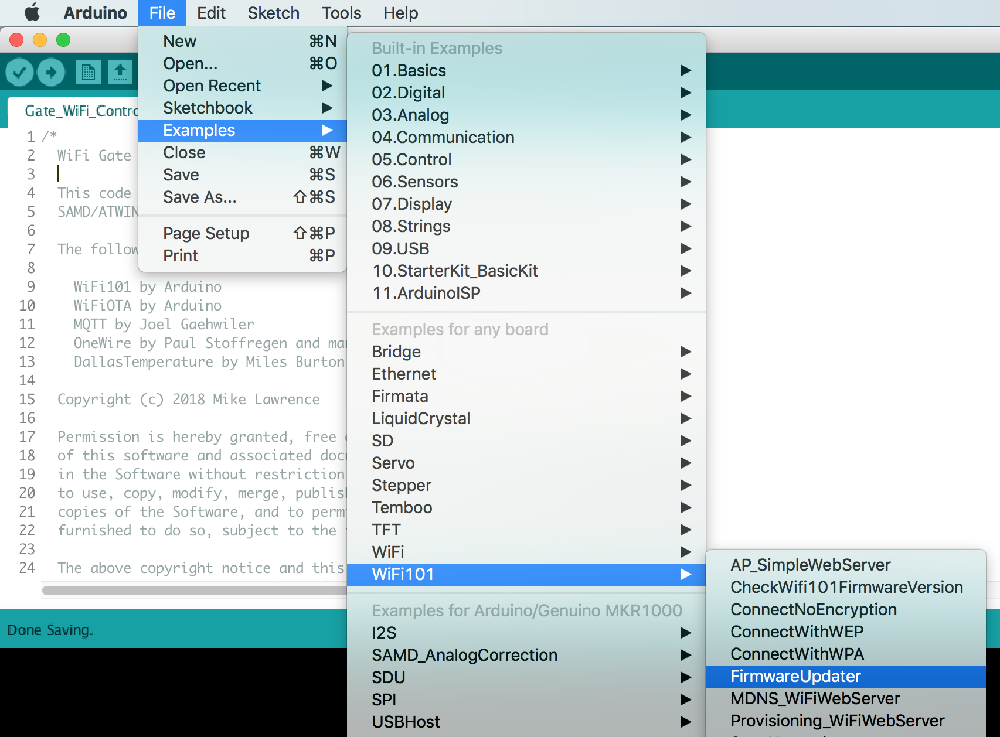

Now "Upload" the "WiFi101 FirmwareUpdater" example.

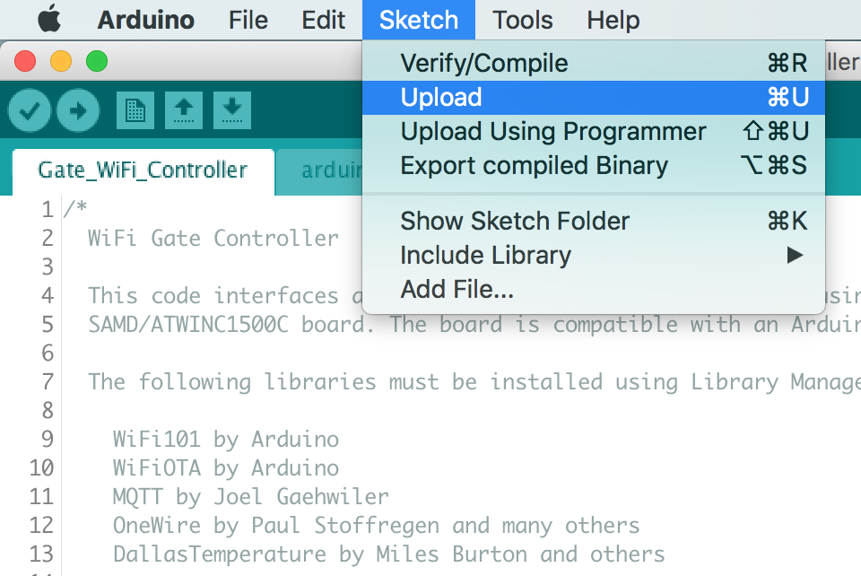

Update the ATWINC1500 module by selecting "WiFi101 Firmware Updater".

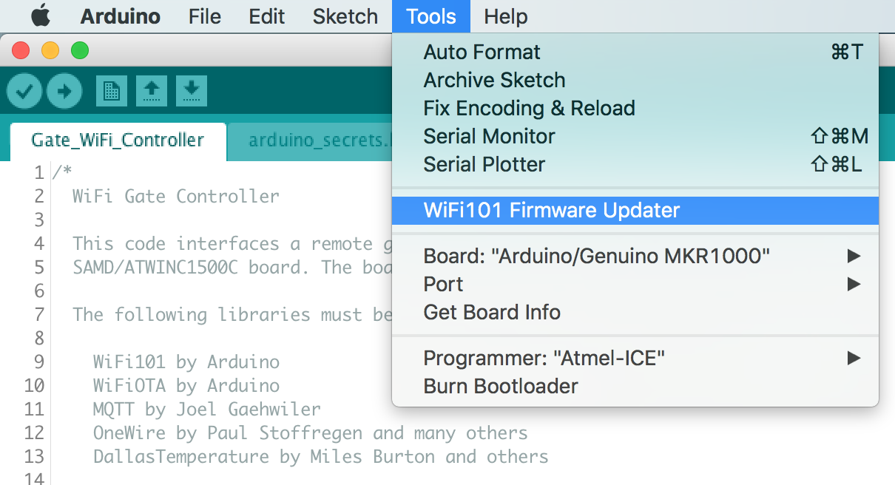

Click the "Update Firmware" button.

Finally open the "Septic_WiFi_Controller.ino" sketch downloaded from GitHub. Update the necessary defines for your Wireless network and MQTT server settings see the [Code README](code/README.md) for more information. Now upload it just like the "WiFi101 FirmwareUpdater" example. All done!

# Acknowledgments
[Arduino](www.arduino.cc) kindly develops open source hardware and software which makes writing software for the board incredibly easy.
